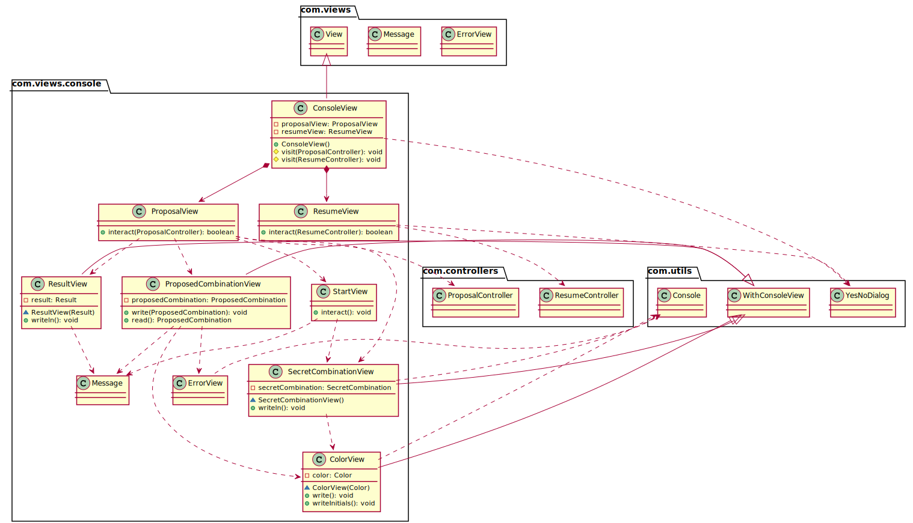

<h1 align="center">Solución dv.withoutFactoryMethod   👨🏻‍💻   </h1>

Esta versión está realizada basándonos en el resultado que dio el profesor sobre el documentView para no distanciarnos mucho en la respuesta final.

Índice

<ul class="sectlevel1">
<li><a href="#vista-de-lógicadiseño">Vista de Lógica/Diseño</a>
<ul class="sectlevel2">
<li><a href="#arquitectura">Arquitectura</a></li>
<li><a href="#paquete-mastermind">Paquete <em>mastermind</em></a></li>
<li><a href="#paquete-mastermind-views">Paquete <em>mastermind.views</em></a></li>
<li><a href="#paquete-mastermind-views-console">Paquete <em>mastermind.views.console</em></a></li>
<li><a href="#paquete-mastermind-models">Paquete <em>mastermind.models</em></a></li>
<li><a href="#paquete-mastermind-utils">Paquete <em>mastermind.utils</em></a></li>
</ul>

<h2 id="vista-de-lógicadiseño">Vista de Lógica/Diseño</h2>
Plantemos en esta sección el diseño y la logica de clases de Mastermind mediante Patrón de Vista Separada.

<h3 id="arquitectura">Arquitectura</h3>

<h3 id="paquete-mastermind">Paquete <em>mastermind</em></h3>

<h3 id="paquete-mastermind-views">Paquete <em>mastermind.views</em></h3>

<h3 id="paquete-mastermind-views-console">Paquete <em>paquete-mastermind-views-console</em></h3>

<h3 id="paquete-mastermind-models">Paquete <em>mastermind.models</em></h3>

<h3 id="paquete-mastermind-utils">Paquete <em>mastermind.utils</em></h3>

## Authors

👤 **JuanCBM**
* Github: [@JuanCBM](https://github.com/JuanCBM)

👤 **mahuerta**
* Github: [@mahuerta](https://github.com/mahuerta)
