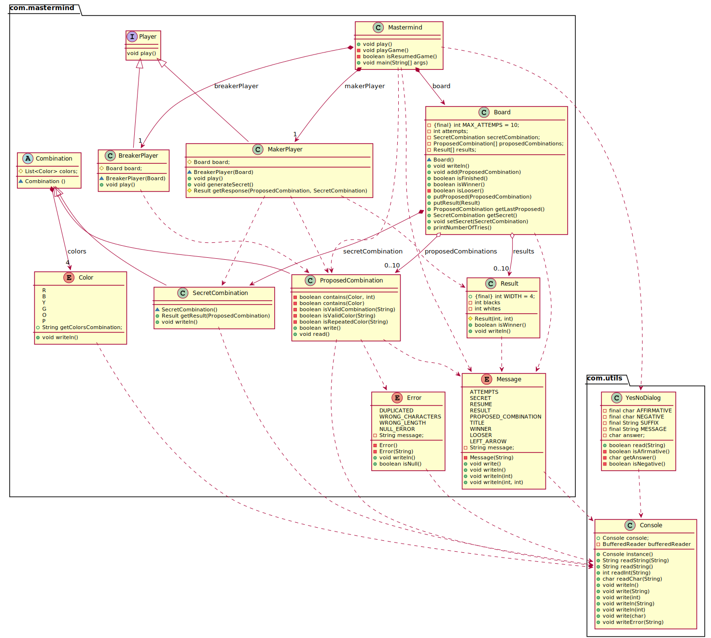

<h1 align="center">Solución domainModel Mastermind   👨🏻‍💻   </h1>

Hemos realizado diferentes versiones hasta conseguir esta planteada.
En un principio realizamos un modelo con la utilización de Turnos, la cual permitía a los dos jugadores realizar la acción de jugar.
Tras ver que realmente la existencia de turnos no era de utilidad, decidimos plantear una solución sin ellos.

### Diagrama UML
Plantemos en esta sección el diseño de clases de Mastermind.

## Authors

👤 **JuanCBM**
* Github: [@JuanCBM](https://github.com/JuanCBM)

👤 **mahuerta**
* Github: [@mahuerta](https://github.com/mahuerta)
