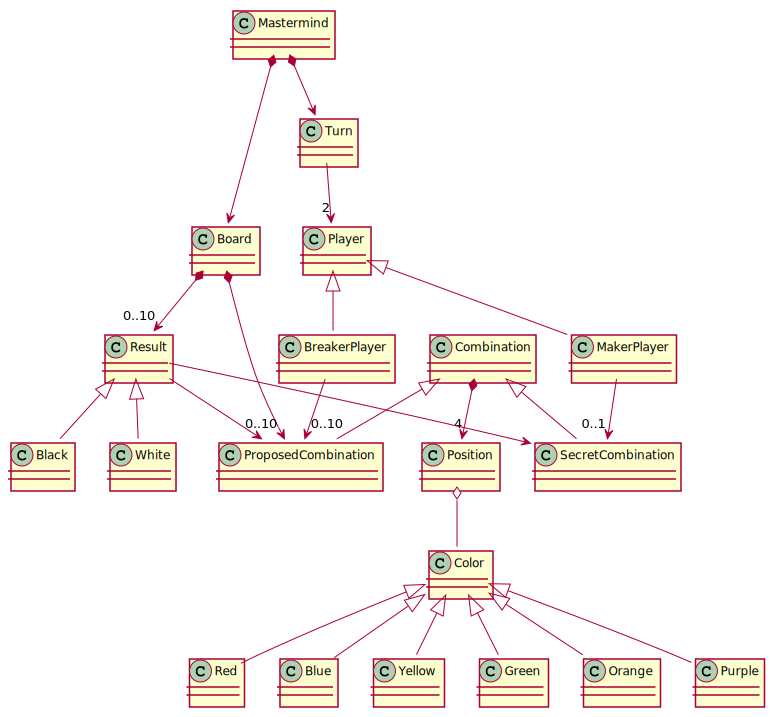

<h1 align="center">Bienvenidos a Mastermind. Rama Master   👨🏻‍💻   </h1>

  
  

### ¿Qué es mastermind?

Mastermind (Español "Mente maestra") es un juego de mesa, de ingenio y reflexión, para dos jugadores.
Puedes encontrar más información en los siguientes enlaces:

**[Wiki Mastermind](https://en.wikipedia.org/wiki/Mastermind_(board_game))**

**[Como se juega a Mastermind](https://www.youtube.com/watch?v=2-hTeg2M6GQ)**

> Versiones de la práctica Mastermind
- [x] [domainModel](https://github.com/mahuerta/MasterMind/tree/domainModel) *
- [x] [documentView](https://github.com/mahuerta/MasterMind/tree/documentView) *
- [x] [dv.withoutFactoryMethod](https://github.com/mahuerta/MasterMind/tree/dv.withoutFactoryMethod) *
- [x] [dv.withFactoryMethod](https://github.com/mahuerta/MasterMind/tree/dv.withFactoryMethod)
- [x] [modelViewPresenter.presentationModel](https://github.com/mahuerta/MasterMind/tree/modelViewPresenter.presentationModel) *
- [x] [mvp.pm.withFacade](https://github.com/mahuerta/MasterMind/tree/mvp.pm.withFacade)
- [x] [mvp.pm.withoutDoubleDispatching](https://github.com/mahuerta/MasterMind/tree/mvp.pm.withoutDoubleDispatching)
- [x] [mvp.pm.withDoubleDispatching](https://github.com/mahuerta/MasterMind/tree/mvp.pm.withDoubleDispatching) *
- [ ] Next Implementations

(*) Versiones con diagramas
 
### Diagrama UML
Planteamos nuestro modelo de dominio realizado antes de la corrección planteada por el profesor.

## Authors

👤 **JuanCBM**
* Github: [@JuanCBM](https://github.com/JuanCBM)

👤 **mahuerta**
* Github: [@mahuerta](https://github.com/mahuerta)
