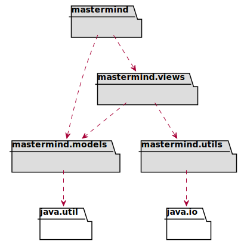
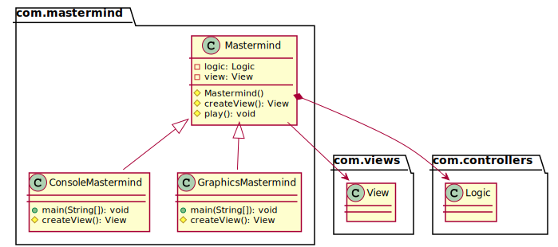
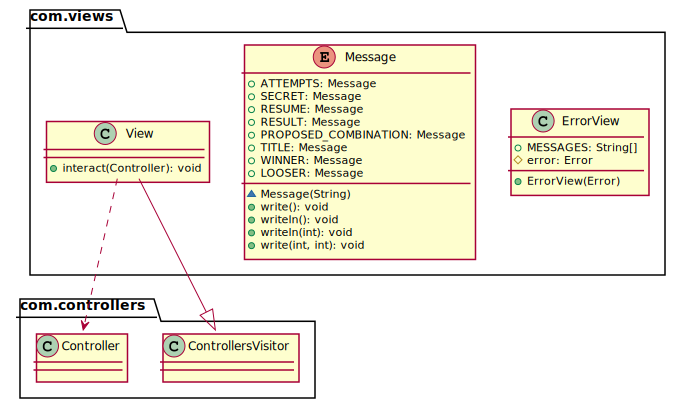
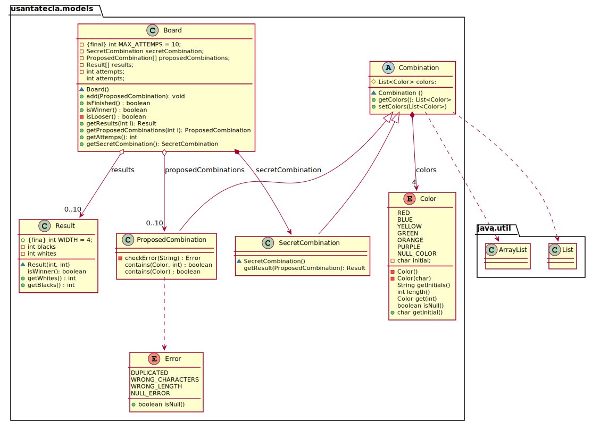

<h1 align="center">Solucion documentView Mastermind   👨🏻‍💻   </h1>

Esta version esta realizada basandonos en el resultado que dio el profesor sobre el domainModel para no distanciarnos mucho en la respuesta final.

### Vista de Logica/Diseño
Plantemos en esta sección el diseño y la logica de clases de Mastermind mediante Patrón de Vista Separada.

<h3 id="arquitectura">Arquitectura</h3>

<h3 id="paquete-mastermind">Paquete <em>mastermind</em></h3>

<h3 id="paquete-mastermind-views">Paquete <em>mastermind.views</em></h3>

<h3 id="paquete-mastermind-models">Paquete <em>mastermind.models</em></h3>

<h3 id="paquete-mastermind-utils">Paquete <em>mastermind.utils</em></h3>

## Authors

👤 **JuanCBM**
* Github: [@JuanCBM](https://github.com/JuanCBM)

👤 **mahuerta**
* Github: [@mahuerta](https://github.com/mahuerta)
